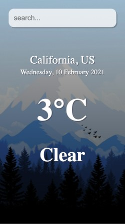
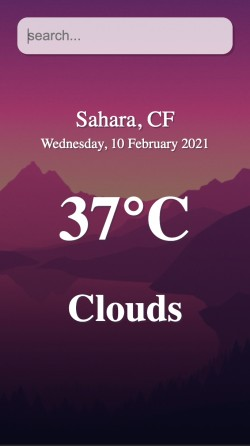

# Weather Application
### In ReactJs

A simple weather web appliction developed in ReactJs 
which will give you weather information as a result.
According to tempreture appliaction changes its ambience.

### Screenshots

### API 

For getting information about current weather a free 
weather api is used from openweathermap.org

https://openweathermap.org/

### How to Run 

Download this repository:
`git clone https://github.com/IshanJawade/weather-app.git`

go in the downloaded repository:\
`cd weather-app-main/`

Dowanload dependencies:\
`npm i `

Start the app on your localhost:\
`npm start`

To see output open your favorite browser and type:\
http://localhost:3000
